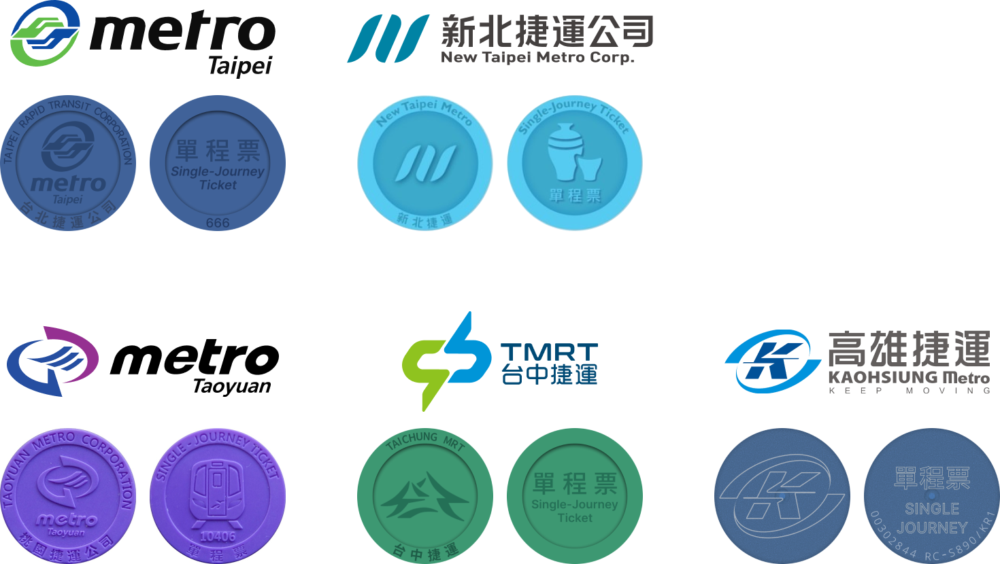

# 台灣捷運票卡資料集 (Taiwan Metro Token)

## 專案介紹

這個倉庫收集了台北捷運、桃園機場捷運、台中捷運與高雄捷運等系統的各種非接觸式票卡資料，包括單程票、一日票、旅遊票與紀念票等。所有票卡經由 Flipper Zero 或 Proxmark3 裝置讀取後提供 `.nfc`、`.bin`、`.json` 等檔案，方便研究台灣票卡系統的運作與逆向工程。資料僅供研究之用，請勿用於實際乘車或其他商業用途。

歡迎對台灣票卡生態、逆向工程有興趣的研究者與開發者參考、分析或貢獻此資料集。

## 資料內容

- **KRTC‑Kaohsiung‑Metro 高雄捷運**： 
晶片類型: SONY FeliCa RC-S890 
此款票卡已停止使用。

- **Taichung‑MRT (TMRT) 台中捷運**： 
晶片類型: NXP MIFARE Ultralight C (MF0ULC) 
3des key: 49454D4B41455242214E4143554F5946 
熱知識: 這個密碼用 ASCII 轉換後是：BREAKMEIFYOUCAN! (Break Me If You Can!)。~~這密碼非常台中，果然是慶記之都。~~ 
包含台中捷運 24hr、48hr、一日票與 2000 萬人次紀念票樣本，每張票以 JSON 格式儲存每個記憶體區塊的十六進位內容。

- **Taipei‑Metro 台北捷運**： 
晶片類型: NXP MIFARE Ultralight EV1 48bytes (MF0UL1101) 
Key: FFFFFFFF 
密碼嘗試次數不限 
  - 目錄下含 `YueLao‑ticket`(月老票)、`single‑jouney`(單程票)、`travel‑ticket`(旅遊票) 等子資料夾。每張票提供 `.bin` 和 `.json` 兩種檔案，分別為原始二進位與解析後的記憶體資料。
  - 另有單獨儲存的「錦夜」紀念一日票與 2024 年北捷一日票供參考。

- **Taoyuan‑Airport‑MRT 桃園機場捷運**： 
單程票 
晶片類型: NXP MIFARE Ultralight EV1 48bytes (MF0UL1101) 
Key: FFFFFFFF 
密碼嘗試次數不限 

- **img**： 提供各種票卡正反面圖片及設計稿，以便對照研究。下面的圖片分別示意北捷與高捷單程票背面的設計：

> **注意**：資料集中包含部分尚未使用或已使用過的票卡，其數據僅供學術研究、逆向工程與票卡生態分析之用，**嚴禁**用於實際乘坐捷運或任何商業用途。

## dump 檔案格式說明

| 格式 | 來源裝置 | 說明 |
|------|-----------|------|
| `.nfc` | Flipper Zero | FeliCa 卡片資料，由 Flipper Zero 讀取後儲存的票卡資訊，內容包含 UID、區塊資料及其他屬性 |
| `.bin` | Proxmark3 | 由 Proxmark3 讀取的二進制檔案( `hf mfu dump` ) |
| `.json` | Proxmark3 | 對應 `.bin` 檔的解析版本，列出卡片 UID、版本資訊以及各記憶體區塊的十六進位值 |

## 版權與責任聲明

- 本倉庫所提供的所有資料**僅供研究與學術討論用途**，禁止用於任何非法或商業行為。
- 資料來源為自行購買或收集之票卡，經合法讀取後分享。